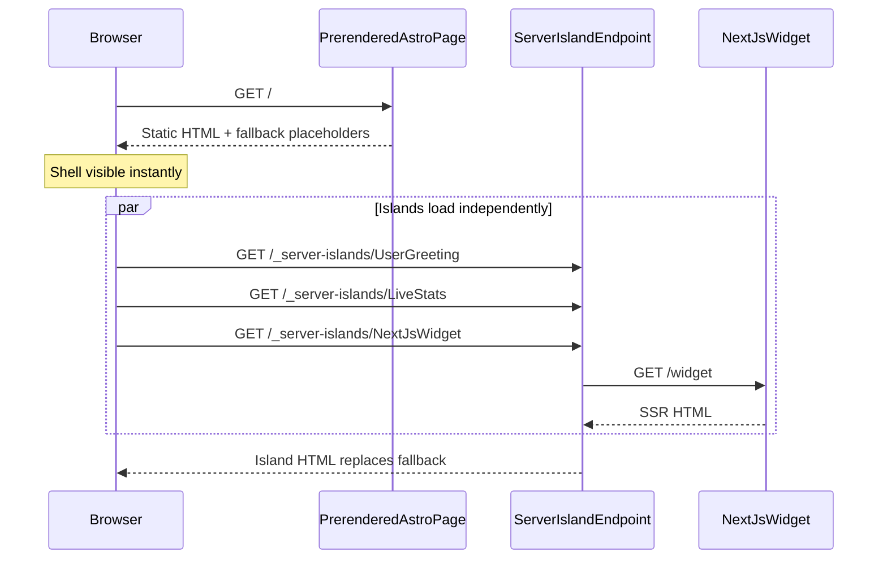
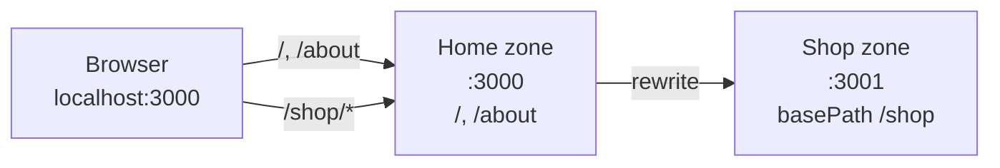
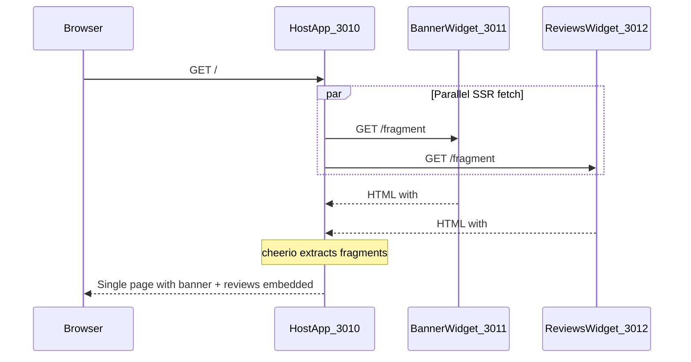

# Micro-Frontend POC

A collection of small, self-contained demos — each in its own top-level folder — showcasing a different micro-frontend technique.

This repo uses **pnpm** as the package manager. Install it if needed:

```bash
corepack enable
corepack prepare pnpm@latest --activate
```

**Requirements:** Node.js ≥ 22.12

## Demos

| Demo | Technique | Composition level | Entry point |
|------|-----------|-------------------|-------------|
| [astro-server-islands](./astro-server-islands/) | Astro Server Islands + Next.js SSR widget | Same page, deferred islands | `http://localhost:4321` |
| [nextjs-multizone](./nextjs-multizone/) | Next.js Multi-Zones | Route / path level | `http://localhost:3000` |
| [fetch-embed-fragments](./fetch-embed-fragments/) | Fetch & embed SSR HTML fragments | Same page, server-side embed | `http://localhost:3010` |

### [Astro Server Islands](./astro-server-islands/)

A static Astro page shell loads immediately while dynamic UI fragments render independently on the server. Includes a separate Next.js app embedded via a server island.

#### Architecture



**How it works:** Astro prerenderes the page shell at build time. Components marked with `server:defer` become server islands — at runtime the browser fetches each island from a dedicated `/_server-islands/` endpoint and swaps it in over a fallback placeholder. Islands load **independently**, so a slow fragment does not block faster ones. The Next.js widget is a cross-framework island: Astro fetches SSR HTML from a separate app and injects it.

| App | Port | Role |
|-----|------|------|
| Astro host | 4321 | Prerendered shell + server islands |
| Next.js widget | 3000 | SSR React fragment consumed by an island |

**Best for:** Mostly static pages with a few dynamic, independently cacheable regions — without splitting the whole site by route.

```bash
cd astro-server-islands
pnpm install
pnpm run dev
```

Starts Astro (`:4321`) and the Next.js widget (`:3000`). See [astro-server-islands/README.md](./astro-server-islands/README.md) for details.

---

### [Next.js Multi-Zones](./nextjs-multizone/)

Two independent Next.js apps on one domain — the home zone proxies `/shop/*` to a separate shop zone via rewrites. Each zone owns a distinct set of URL paths.

#### Architecture



**How it works:** Multi-zones split a domain into separate Next.js applications by **path**. The home app defines `rewrites` in `next.config.ts` to forward `/shop` and `/shop/*` to the shop app. The shop app sets `basePath: '/shop'` so its pages, assets, and links stay namespaced. Users always browse via the home domain — routing between zones is transparent. Navigating **within** a zone is a soft client transition; crossing zones requires a full navigation via `<a>` tags (not `Link`).

| Zone | Port | Paths | Role |
|------|------|-------|------|
| Home | 3000 | `/`, `/about` | Main app + rewrite proxy |
| Shop | 3001 | `/shop`, `/shop/*` | Independent micro-frontend |

**Best for:** Large products that split naturally by route (marketing, shop, dashboard) where each section can be built and deployed separately.

```bash
cd nextjs-multizone
pnpm install
pnpm run dev
```

Starts the home zone (`:3000`) and shop zone (`:3001`). See [nextjs-multizone/README.md](./nextjs-multizone/README.md) for details.

---

### [Fetch & Embed SSR Fragments](./fetch-embed-fragments/)

Same-page micro-frontend composition — a host app server-fetches HTML from two independent widget apps and embeds them on **one URL**. No Module Federation, no iframes.

#### Architecture



**How it works:** Each widget app exposes a dynamic SSR page at `/fragment` with its UI wrapped in `<div id="fragment-root">`. When the host page renders on the server, it fetches both fragment URLs in parallel, extracts the root element from each response with cheerio, and injects the HTML via `dangerouslySetInnerHTML`. The browser receives one complete page containing content from three independent apps.

| App | Port | Role |
|-----|------|------|
| Host | 3010 | Fetches and composes fragments on one page |
| Banner widget | 3011 | Promo banner SSR fragment |
| Reviews widget | 3012 | Reviews list SSR fragment |

**Best for:** Composing multiple independently deployed UI pieces on the same page when you want a simple HTTP-based contract instead of runtime JavaScript federation.

```bash
cd fetch-embed-fragments
pnpm install
pnpm run dev
```

Starts host (`:3010`), banner widget (`:3011`), and reviews widget (`:3012`). See [fetch-embed-fragments/README.md](./fetch-embed-fragments/README.md) for details.

---

## Comparing the three approaches

| | Server Islands | Multi-Zones | Fetch & Embed |
|--|----------------|-------------|---------------|
| **Split level** | Component (deferred) | Route / path | Component (same response) |
| **Same page?** | Yes | No — one zone per path | Yes |
| **When content loads** | After shell (client fetches islands) | On navigation to that zone's path | During host SSR (blocks until all fragments return) |
| **Cross-framework** | Yes (demo uses Next.js widget) | Typically all Next.js | Yes — any SSR HTTP endpoint |
| **Independent deploy** | Per island provider | Per zone | Per widget app |

## Repo layout

```
mfe-poc/
├── AGENTS.md                 # Instructions for AI assistants
├── README.md                 # This file
├── astro-server-islands/     # Demo 1
├── nextjs-multizone/         # Demo 2
│   ├── home/                 # Main zone (nested app)
│   └── shop/                 # Shop zone (nested app)
└── fetch-embed-fragments/    # Demo 3
    ├── host/                 # Composes fragments on one page
    ├── banner-widget/        # SSR fragment provider
    └── reviews-widget/       # SSR fragment provider
```

Each demo is independent — install dependencies and run scripts from within its folder. Nested apps (e.g. `next-widget/`, `home/`, `shop/`) are managed by their parent demo's scripts.

## Adding a new demo

Create a new top-level folder (e.g. `module-federation/`), add a README with run instructions, and link it from this file. See [AGENTS.md](./AGENTS.md) for conventions.
