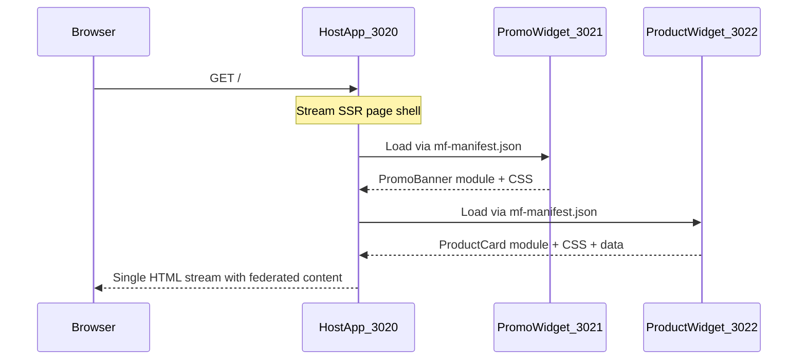

# Modern.js Module Federation SSR POC

A minimal demo of **same-page micro-frontend composition** using Modern.js v3 + Module Federation 2.0 with streaming SSR.

Unlike [fetch-embed-fragments](../fetch-embed-fragments/) (HTTP HTML injection) or [nextjs-multizone](../nextjs-multizone/) (route-level splitting), this demo loads **federated JavaScript modules at runtime** and server-renders them on a single page.

## Architecture



| App | Port | Role |
|-----|------|------|
| `host/` | 3020 | Consumer — composes remotes with `createLazyComponent` |
| `promo-widget/` | 3021 | Provider — exposes `./PromoBanner` |
| `product-widget/` | 3022 | Provider — exposes `./ProductCard` (+ SSR data fetch) |

## How it works

1. Each remote app exposes a React component via `module-federation.config.ts` (`exposes` field).
2. Remotes serve a manifest at `/mf-manifest.json` consumed by the host at build/runtime.
3. All apps use **stream SSR** (`server.ssr.mode: 'stream'`) — required for MF + SSR.
4. The host loads remotes with `createLazyComponent` (not bare `import`) so remote CSS is injected during SSR — no flicker.
5. `ProductCard.data.ts` demonstrates remote-side SSR data fetching via `fetchData` + `mfData` prop.

**Important:** Application-level modules (`createRemoteAppComponent`) do not support SSR. This demo uses **component-level** federation only.

## Comparison with other demos

| | MF SSR (this demo) | Fetch & Embed | Multi-Zones |
|--|---------------------|---------------|-------------|
| **Contract** | JS modules via mf-manifest | HTTP HTML fragments | URL path rewrites |
| **Same page?** | Yes | Yes | No |
| **Client hydration** | Yes — shared React singletons | Static HTML only | Full page per zone |
| **Framework** | Modern.js v3 native | Any SSR HTTP endpoint | Next.js only |

## Run locally

All three apps must be running:

```bash
pnpm install
pnpm run dev
```

Open [http://localhost:3020](http://localhost:3020).

Run individually:

```bash
pnpm run dev:promo    # :3021
pnpm run dev:product  # :3022
pnpm run dev:host     # :3020 (requires remotes running)
```

## What to observe

1. Host shell + blue promo banner + green product card on **one page**
2. View page source — remote HTML and CSS are present (no FOUC)
3. Click **Test interactivity** on the promo banner — client hydration works on the federated module
4. Stop `product-widget` — host shows fallback for ProductCard only; PromoBanner still works
5. Product card shows server-fetched data with a timestamp from the remote

## Production build

Build remotes **before** the host:

```bash
pnpm run build
pnpm run serve:promo    # :3021
pnpm run serve:product  # :3022
pnpm run serve:host     # :3020
```

## Project structure

```
modernjs-mf-ssr/
├── host/
│   ├── module-federation.config.ts   # remotes config
│   └── src/routes/page.tsx           # createLazyComponent consumers
├── promo-widget/
│   ├── module-federation.config.ts   # exposes ./PromoBanner
│   └── src/components/PromoBanner.tsx
└── product-widget/
    ├── module-federation.config.ts   # exposes ./ProductCard
    └── src/components/
        ├── ProductCard.tsx
        └── ProductCard.data.ts       # SSR data fetch
```

## References

- [Modern.js v3 release — MF integration](https://modernjs.dev/community/blog/v3-release-note)
- [Module Federation + Modern.js quick start](https://module-federation.io/integrations/framework/modernjs/quick-start)
- [Modern.js MF SSR guide](https://modernjs.dev/guides/topic-detail/module-federation/ssr)
