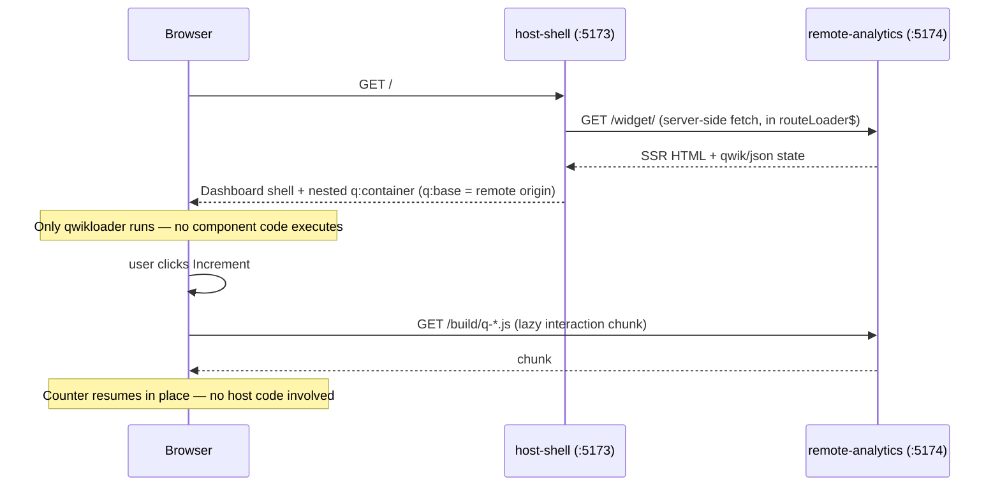

# Qwik Resumable Micro-Frontend

A demo of **cross-origin container composition** using Qwik's resumability — the host server-fetches an independent Qwik City app's SSR output and resumes it in place, without hydrating either app or sharing a JavaScript bundle between them.

Unlike the other demos in this repo, the embedded app here is not just static HTML: it stays fully interactive after being lifted into the host page, and its interaction code is fetched lazily from its **own origin** the first time a user interacts with it.

## Architecture



| App | Port | Role |
|-----|------|------|
| `apps/host-shell/` | 5173 | Enterprise dashboard shell; fetches and composes the remote widget |
| `apps/remote-analytics/` | 5174 | Independent Qwik City app exposing an isolated, resumable widget at `/widget/` |

## How it works

1. `remote-analytics` exposes `/widget/` — a route with no page chrome, wrapping a single `CounterWidget` in `<div id="widget-root">`. Visiting it directly renders a complete, resumable Qwik document.
2. `host-shell`'s `routeLoader$` (in [`src/routes/index.tsx`](apps/host-shell/src/routes/index.tsx)) fetches that URL **server-side** on every request — a plain HTTP call, not a JavaScript import.
3. [`src/lib/fetchRemoteWidget.ts`](apps/host-shell/src/lib/fetchRemoteWidget.ts) parses the response with `cheerio` and extracts:
   - the `#widget-root` element,
   - its serialized `<script type="qwik/json">` state,
   - any inlined sync-QRL functions (`<script q:func="qwik/json">`),

   then rebuilds them inside a new container element with a rewritten, **absolute** `q:base` pointing at the remote's own origin (`http://localhost:5174/build/`).
4. [`src/components/remote-widget-slot.tsx`](apps/host-shell/src/components/remote-widget-slot.tsx) injects that markup with `dangerouslySetInnerHTML` into the dashboard's main panel.
5. The host's own qwikloader (already present on every Qwik City page) resolves the nested container's `on:click` QRLs against its `q:base` and, on first click, fetches the interaction chunk directly from `http://localhost:5174/build/`.

No Module Federation, no iframes, and no shared JavaScript bundle — the only contract between the two apps is an HTTP response and Qwik's own serialization format.

## Forwarding server-side context (session auth)

The remote's SSR fetch happens entirely server-to-server, so the host is free to attach whatever context the remote needs as plain HTTP headers — no browser involved, no CORS preflight. This demo forwards a session identifier as a concrete example:

1. [`src/routes/plugin.ts`](apps/host-shell/src/routes/plugin.ts) stands in for a real login flow: it issues a demo `session` cookie on the host's own domain the first time a browser visits, via `onRequest` (runs before every route in the app).
2. [`src/routes/index.tsx`](apps/host-shell/src/routes/index.tsx)'s `routeLoader$` reads that cookie and passes its value into `fetchRemoteWidget`.
3. [`src/lib/fetchRemoteWidget.ts`](apps/host-shell/src/lib/fetchRemoteWidget.ts) forwards it as a `Cookie: session=<id>` header on the outgoing fetch — only that one cookie, never the host's full incoming `Cookie` header — alongside an `x-internal-trust` header carrying a shared secret.
4. On the remote, [`src/routes/widget/index.tsx`](apps/remote-analytics/src/routes/widget/index.tsx) exports an `onRequest` guard that rejects any request missing the correct `x-internal-trust` value with `403`, then a `routeLoader$` that reads the forwarded `session` cookie with the remote's own `cookie.get()` — no custom parsing needed, since it arrived as a normal `Cookie` header.
5. The resolved session is passed down into `CounterWidget`, which renders it (`Session forwarded from host: <id>`) so you can see it land — [`src/components/counter-widget.tsx`](apps/remote-analytics/src/components/counter-widget.tsx).

**Why the trust header, not just the cookie:** forwarding `session` alone proves nothing on its own — the remote's `/widget/` route is reachable directly over the network (`curl http://localhost:5174/widget/`), so anyone could invent a `Cookie: session=whatever` header and impersonate a logged-in user. The `x-internal-trust` header is what actually proves a request came from host-shell rather than an arbitrary caller; the demo's default secret (`dev-only-shared-secret`) is a local-dev placeholder only — override it with the `INTERNAL_TRUST_SECRET` env var (set identically on both apps) in any real deployment, and never reuse the literal default value in production. Try it yourself:

```bash
curl -i http://localhost:5174/widget/                                              # 403 — no trust header
curl -i -H "x-internal-trust: dev-only-shared-secret" http://localhost:5174/widget/ # 200
curl -i http://localhost:5174/                                                     # 200 — standalone route, unguarded
```

## What to look for (and one honest caveat)

- **No shared bundle:** [`apps/host-shell/package.json`](apps/host-shell/package.json) has zero dependency on `remote-analytics`. The only new dependency added to the host is `cheerio`, for parsing the fetched HTML.
- **The `q:base` attribute:** inspect the host's rendered HTML and you'll find `<div id="remote-analytics-container" q:container="paused" q:base="http://localhost:5174/build/" ...>`. This is what tells the host's qwikloader where to fetch the remote's chunks from.
- **Caveat:** Qwik City itself (independent of this demo) always loads a small SPA-router bootstrap chunk on page load, for scroll restoration and client-side navigation — this is present on every Qwik City site and is unrelated to any dashboard or widget logic. "Zero JavaScript on load" below refers to zero **application-level** code (no dashboard logic, no counter logic) — not literally zero bytes over the wire. See the verification steps for how to tell the two apart.

## Run locally

```bash
cd qwik-resumable-mfe
pnpm install
pnpm run dev
```

This starts both apps: host-shell (`:5173`) and remote-analytics (`:5174`). Both must be running — open [http://localhost:5173](http://localhost:5173).

Run individually:

```bash
pnpm run dev:remote   # :5174/widget/
pnpm run dev:host     # :5173 (requires the remote running)
```

If `remote-analytics` isn't reachable, the host renders a visible error panel instead of failing the page.

## Verify it for yourself

### 1. Zero application JavaScript on initial load

1. Open DevTools → **Network**, filter to **JS**, and check "Disable cache".
2. Hard-reload `http://localhost:5173`.
3. You'll see two scripts load automatically from the host's own origin (`:5173`):
   - `q-*.js` (~1.7 kB gzipped) — the qwikloader, required for any Qwik page to become interactive.
   - one more `q-*.js` chunk (~20 kB gzipped) — Qwik City's own SPA-router bootstrap (`qcinit`), framework machinery unrelated to the dashboard or the widget.
4. Crucially, **no chunk referencing the counter widget or dashboard loads** — those symbols (`CounterWidget_component_onIncrement...`) don't appear in the Network tab at all until you interact.

### 2. The remote's interaction code loads only from its own origin, only on click

1. Keep the Network tab open.
2. Click **Increment** on the embedded widget.
3. A new request appears for a `q-*.js` chunk, but this time **from `http://localhost:5174`**, not `:5173`.
4. The counter updates in place — no full page reload, no host code re-executed.

### 3. Inspect the container boundary directly

```bash
curl -s http://localhost:5173/ | grep -o 'q:container="paused"[^>]*'
```

You should see the nested container's attributes, including `q:base="http://localhost:5174/build/"`.

## Production build

```bash
pnpm run build
```

Builds `remote-analytics` first, then `host-shell` (the host doesn't depend on the remote's build output — this order only reflects that you'll want the remote's assets published before pointing the host at it). To preview each app's production build locally:

```bash
pnpm --filter remote-analytics run build.preview && pnpm --filter remote-analytics exec vite preview
pnpm --filter host-shell run build.preview && pnpm --filter host-shell exec vite preview
```

Point the host at a deployed remote by setting environment variables before starting it:

```bash
REMOTE_WIDGET_URL=https://analytics.example.com/widget/ \
REMOTE_ASSET_BASE=https://analytics.example.com/build/ \
pnpm --filter host-shell start
```

## Project structure

```
qwik-resumable-mfe/
├── pnpm-workspace.yaml
├── package.json
└── apps/
    ├── host-shell/
    │   └── src/
    │       ├── components/
    │       │   ├── enterprise-shell.tsx     # static dashboard chrome, no interactivity
    │       │   └── remote-widget-slot.tsx   # mounts the injected container
    │       ├── lib/fetchRemoteWidget.ts     # fetch + cheerio extract + q:base rewrite + session/trust headers
    │       └── routes/
    │           ├── plugin.ts                # issues a demo session cookie on first visit
    │           └── index.tsx                # routeLoader$ server-fetches the widget
    └── remote-analytics/
        └── src/
            ├── components/counter-widget.tsx  # component$() + useStore() + $() handler
            └── routes/widget/index.tsx        # isolated, chrome-free embeddable route + trust guard
```

## Related demos

- [Fetch & Embed SSR Fragments](../fetch-embed-fragments/) — the same server-fetch-and-embed idea, but for static (non-resumable) HTML fragments.
- [Modern.js Module Federation SSR](../modernjs-mf-ssr/) — same-page composition via runtime JS federation instead of a container protocol.
